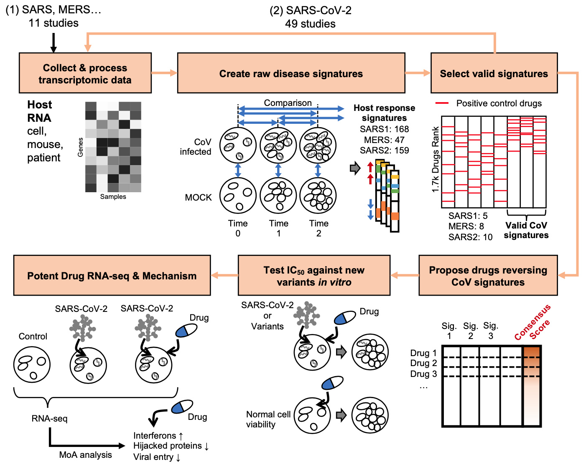

# Reversal of Infected Host Gene Expression Identifies Repurposed Drug Candidates for COVID-19

## Abstract
Repurposing existing drugs is a timely option to cope with COVID-19. We sought to target infection-induced genes in the host cells, hoping to mitigate disease progression and alleviate symptoms. Based on our previous experience that reversal of gene expression (namely **sRGES**) correlates to drug efficacy, we utilized **a systems-based approach that employs gene expression profiles of SARS-/MERS-CoV infected samples** (as COVID-19 samples not available at the time of writing) **and drug-induced gene expression profiles from cell lines to discover new thereapeutic candidates for COVID-19**. 430 samples from 12 studies of SARS-/MERS-CoV infection were collected from [GEO](https://www.ncbi.nlm.nih.gov/geo/), 215 comparisons across all the infection time duration were employed to create different infection signatures and predict drug candidates. Drugs effective to SARS or MERS served as positive control to select valid signatures that captured virus induced biology change in the host cells. Finally we computed the consensus score of drug predictions derived from all the valid infection signatures to generate the final prediction.

## Instructions

### Before Running
Create data folder and code folder. Download data from Chen lab server (/home/ubuntu/chenlab_v2/chenlab_data/raw.zip), and unzip to data folder. Clone code and unzip to the code folder.

### Enumerate All Comparisons & Create Disease Signatures
Virus infection studies meta information were stored in *"meta.csv"*, including GEO ID, virus type, organism, time point, description, etc. Each comparison would results in an infection signature (i.e. a list of differential expressed genes) and a drug repurposing prediction list (if the size of signature is large enough to make reliable prediction).

* Tips:
  + method_id = 3: by default we use SAM (3), but if we could not find enough signature genes, use rankProd (2)

Three ways of comparisons:
1. Between virus and mock at the same time point

  + *"Workflow_meta_case_vs_CT_one_time.R"*

2. Between 2 time points within the virus/mock infection group

  + *"workflow_meta_time_all.R"*

3. Between 2 time points within the virus group, then extract same genes from mock group

  + Also in *"workflow_meta_time_all.R"*

### Drug sRGES Prediction
A drug repurposing library with 1740 well investigated drugs was predicted the reversal of each infection signature after you ran the 2 workflow R script mentioned in the previous section, if the signature genes could be mapped to > 50 LINCS landmark genes. See the drug prediction results in "sRGES_drugs.csv" of each disease signature folder.

### Signature Validation & Selection
Run *"get_consensus_rank.py"*.

Valid signatures would show in *"comparisons_selected.csv"*. Metrics of all signatures in *"comparisons_validation_all-signatures.csv"*.

Visualization of positive control drugs enrichment would show in 2 pdf files.

### Drug Consensus Score
In *"consensus_rank_sRGES_drugs_CaseVSCtrl.csv"*, the lower "Median_Rank" of a drug, the better it reversed all valid signatures.

### Other Analysis
* MoA Enrichment
  + *"enrichment_consensus_rank.py"* gives enrichment of MoA based on drug consensus rank results.
  + *"plot_enrichment_moa.py"* visualizes the enrichment analysis.
  
* Visualize the reversal of selected candidates
  + *"visualize_dzSig_drugSele.py"* generates the heatmap of common disease genes reversal by the candidates.

